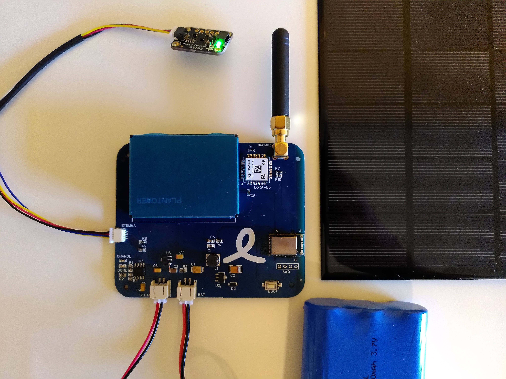

# OpenAirMonitor

**Work in progress**

The OpenAirMonitor is a solar-powered, outdoor air quality monitor that transmits data over LoRaWAN and Bluetooth LE. It measures particulates (PM1, PM2.5 and PM10), humidity and temperature. The monitor has a STEMMA QT connector, so can be extended with other sensors.

The monitor is programmed in JavaScript over Bluetooth LE using [Espruino](https://www.espruino.com/).

The following components can be connected to the PCB:

- PMS7003 particulate matter sensor
- 868MHz (EU/UK) SMA antenna
- 3.7V LiPo battery, e.g. [this 6600mAh battery](https://shop.pimoroni.com/products/lithium-ion-battery-pack?variant=23417820487)
- 6V solar panel
- [SHT40 temperature & humidity sensor](https://shop.pimoroni.com/products/adafruit-sensirion-sht40-temperature-humidity-sensor-stemma-qt-qwiic) using STEMMA QT connector

## Hardware

See this [OSHWLab project](https://oshwlab.com/gendor/air-quality-monitor) for schematic, PCB layout and Bill of Materials.

The LoRa-E5 module can be obtained from [Seeed Studio's webshop](https://www.seeedstudio.com/LoRa-E5-Wireless-Module-p-4745.html), or as part of their [Fusion PCB Assembly Service](https://www.seeedstudio.com/prototype-pcb-assembly.html).

## Software

Upload `main.js` to the MDBT42Q module over Bluetooth LE using Espruino.
